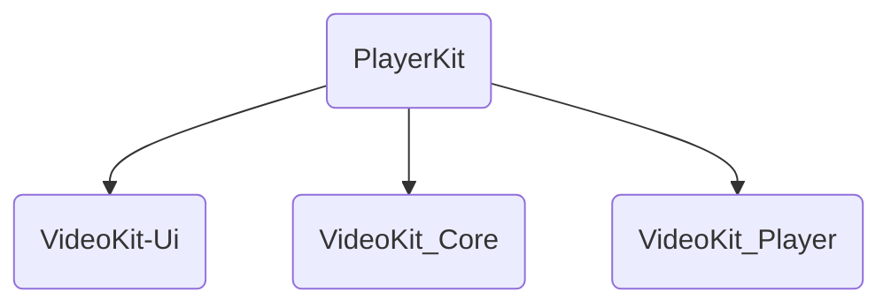
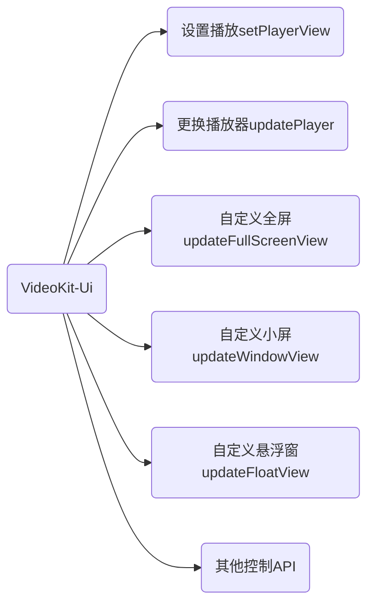
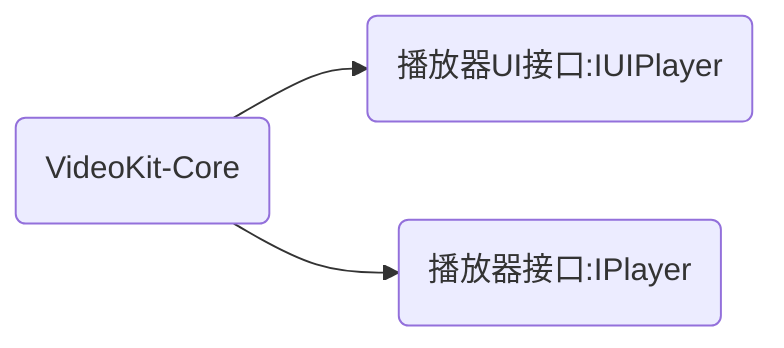
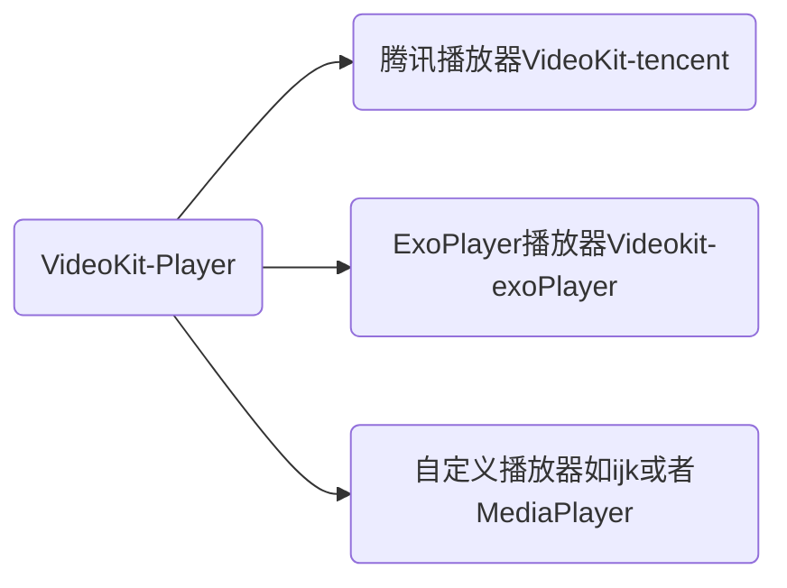

## PlayerKit

具备播放器基本功能，以及

1. - [X] 竖屏切换
2. - [X] 悬浮窗播放(TX已实现，exo已实现)
3. - [X] 画质切换,player实现(TX已实现，exo已实现)
4. - [X] 硬件加速,player实现(TX已实现，exo默认就是硬件+软件)
5. - [X] 倍速播放,player实现(TX已实现，exo已实现)
6. - [X] 镜像播放,player实现(TX已实现，exo没有实现)
7. - [X] 手势控制
8. - [ ] 支持直播与点播,目前是各自的player,自己去实现
9. - [ ] 缓存播放,目前是各自的player,自己去实现
10. - [X] 截屏,player实现(TX已实现，exo没有实现)
11. - [X] 设置播放起始位置
12. - [X] 定时播放功能
13. - [X] 自动下一集功能
14. - [X] 自动开始播放
15. - [X] 界面控制
16. - [X] 播放回调
17. - [ ] 雪碧图（暂时移除）、关键点
18. - [X] 自定义悬浮窗(通过`updateFloatView`切换，参照[TXFloatPlayer](./videoKit-tencent/src/main/me/shetj/sdk/video/tx/TXFloatPlayer.kt))
19. - [X] 自定义播放内核 (可以参照[VideoKit-tencent](./videoKit-tencent)) 和[VideoKit-exoPlayer](./videoKit-exoPlayer)):通过`   updatePlayer(playerImpl)` 进行切换
20. - [X] 自定义全屏：通过`updateFullScreenView`切换
21. - [X] 自定义小屏：通过`updateWindowView`切换

### TODO --- 应该交给使用者自己去定义
22. - [ ] 单例全局播放器

### TODO
23. - [ ] 根据重量旋转

#### 项目架构

[使用文档wiki](https://github.com/SheTieJun/PlayerKit/wiki)
